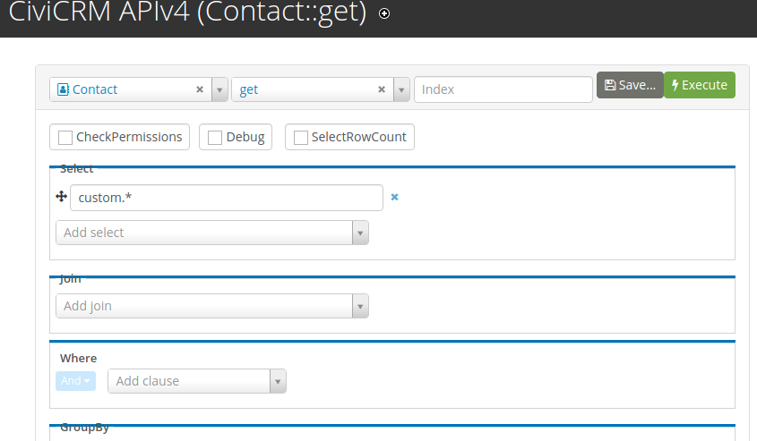
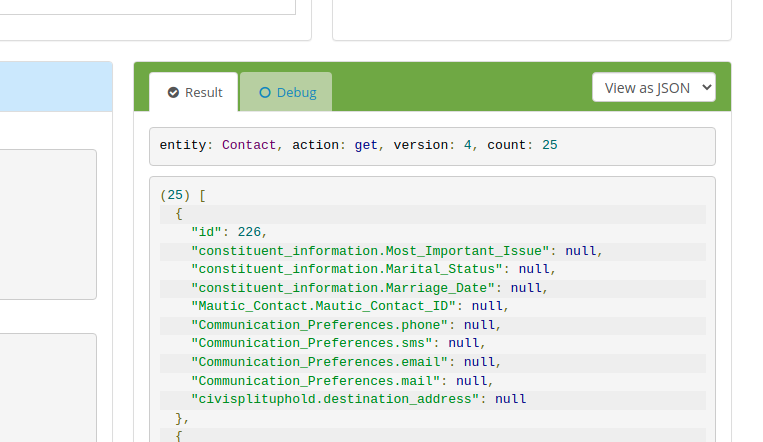
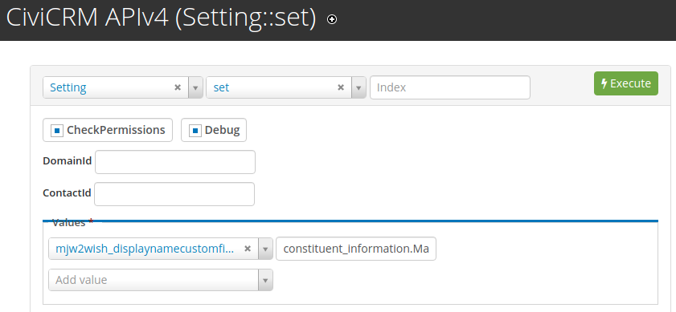

# mjw2wish

The extension is licensed under [AGPL-3.0](LICENSE.txt).

## Requirements

The "patchwork" extension from https://github.com/artfulrobot/patchwork

## Installation

Learn more about installing CiviCRM extensions in the [CiviCRM Sysadmin Guide](https://docs.civicrm.org/sysadmin/en/latest/customize/extensions/).

## What this does?

- Adds the contents of a customfield to the contact `display_name` if you specify the name of a custom field in the setting "mjw2wish_displaynamecustomfield".
  Eg. Bob Marley - 123
- Adds " (deceased)" to the end of a contact `display_name` if contact.is_deceased = 1.
  Eg. Bob Marley - 123 (deceased)

The same rules are applied for the relationship tab and "view relationship" even though they are using contact `sort_name`.

## Configuration

You need to set the `mjw2wish_displaynamecustomfield`.
Navigate to Administer->Customize data and screens->MJW 2wish customisations to choose the custom field.
Find the custom field name by using API4 Explorer Contact.Get and look for it in "Select".

Example: `constituent_information.Marital_Status`

1. In the CiviCRM menu navigate to: *Support->Developer->API Explorer v4*
2. Execute `Contact.Get` with Select set to custom.*:

3. In the results you can see the names of the custom fields:

4. Copy the name of the required custom field and set it using `Setting.Set`. Look for the `mjw2wish_displaynamecustomfield` setting and paste the name of the custom field. Then click *Execute*:

